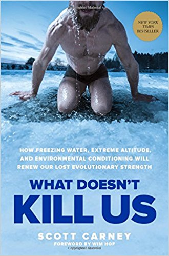
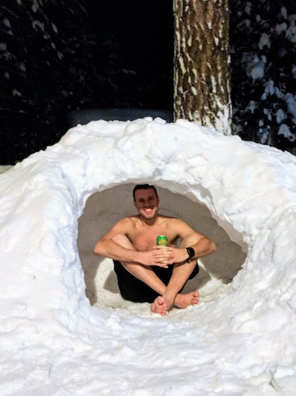
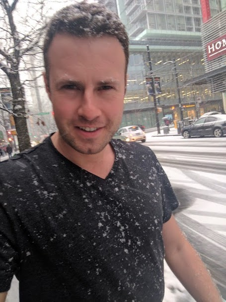
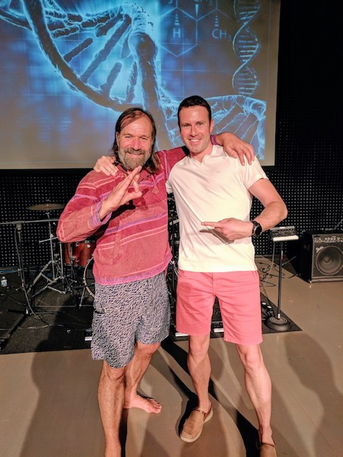
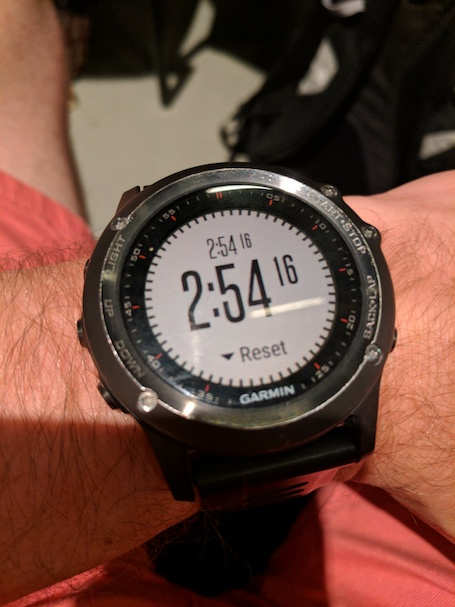
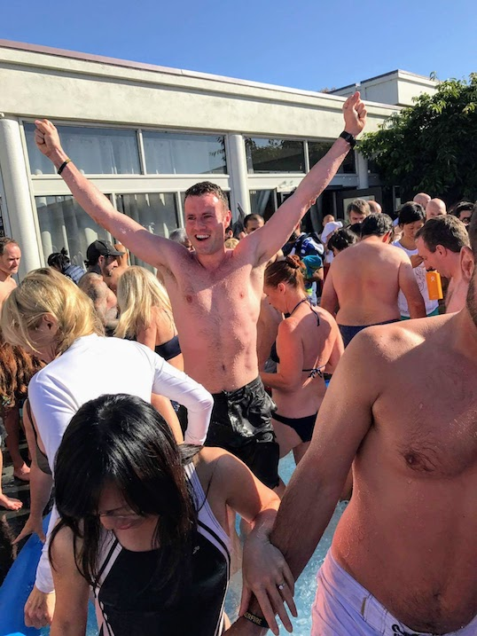

My fascination with cold started with Wim Hof - The Ice Man and [this](http://www.mensjournal.com/health-fitness/articles/what-freezing-water-extreme-altitude-can-do-for-our-health-w455186) article. It prompted me to read Carney's full book *What Doesn't Kill Us*, which gives an introduction into Wim Hof's technique from a skeptic's perspective and supports the story with a solid background on the evolution of humanity in the context of environmental adaptation.

I started experimenting with cold exposure in December 2016, first testing ground with short, 20 second cold showers and gradually increasing time and finding other opportunities to experience low temperatures. Beginnings weren't easy and one of my early log entries reads:

> January 30, 2017 - Freezing morning shower in Vancouver! Body jerk reaction. I hit my head against the shower head.

>February 1, 2017 - This morning mostly focusing on *not* hitting my head against the shower head.

In my observation, the decision to turn the shower knob to the coldest position never gets any easier - our mind has its ways of discouraging us from experiencing discomfort. The actual sensation of cold water does however over time get enjoyable.

Igloo built by my friend on a skiing trip to Lake Tahoe in January 2017.

T-shirt weather in Vancouver, BC, Canada in February 2017. Temperature around 30F.

When the Ice Man was touring North America with a series of workshops on his technique, I signed up right away.

The first part of the workshop was dedicated to the breathing technique, which without any prior practice allowed me to hold my breath for almost 3 minutes and most people around got similar, astonishing results.

The last part was held outdoors, with ice baths prepared in tanks filled with ice mixed with water, in which we would stay submerged up to chin for about 30 seconds.

`youtube: https://www.youtube.com/watch?v=DhD0bS5I2Kg`
I took two icebath sessions that afternoon and even hours later, I still felt chilled to the bone, but happy as never!!

Since then, cold showers became my morning routine (around 2 minutes) and winter jackets stay in the closet.
