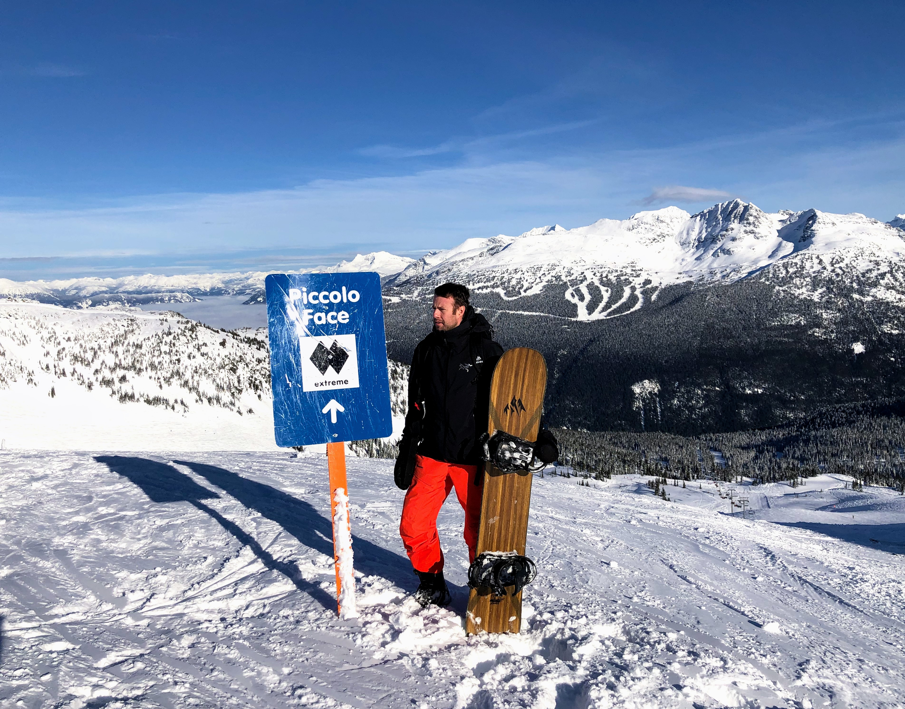
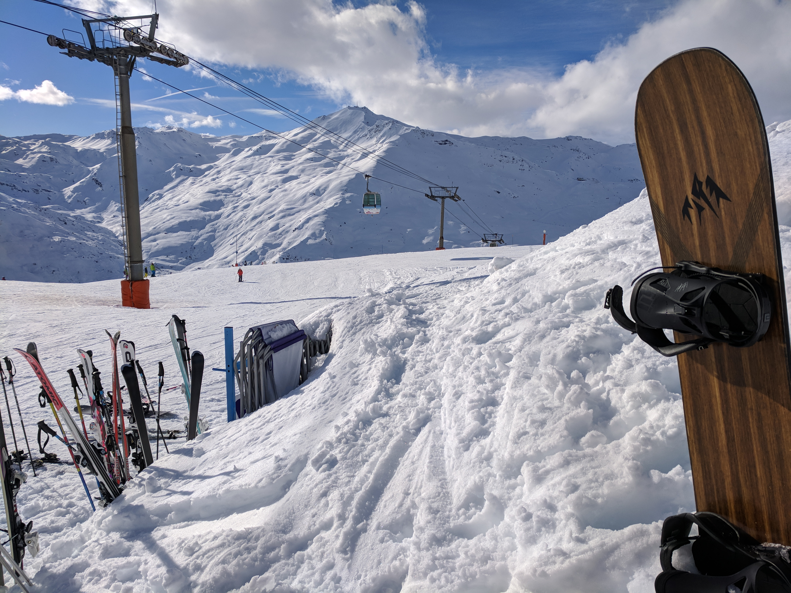

Between the months of December and April I spend most of the weekend on the board, either on multi day trips in Whistler or the Rockies or one day in'n'out trips around Lake Tahoe.

`youtube: https://youtu.be/akDJz3-C0lo`
`youtube: https://youtu.be/Zn2xC1QHPsw`

The board I am using is a Jones Flagship 162W, with Drive Now bindings. Pair this with K2 Thraxis boots and you will get the stiffest, most responsive setup out there.

