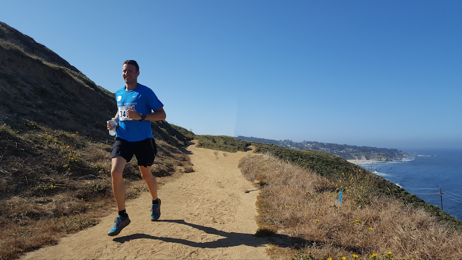
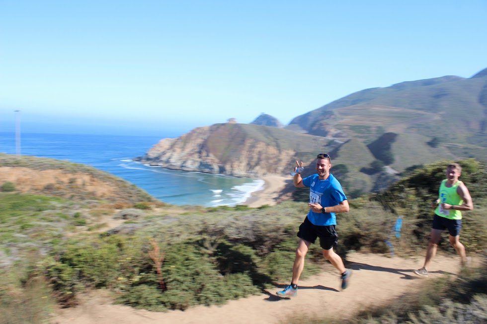
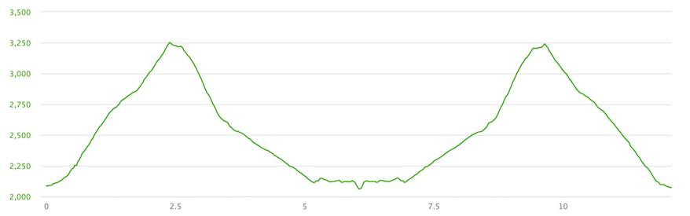
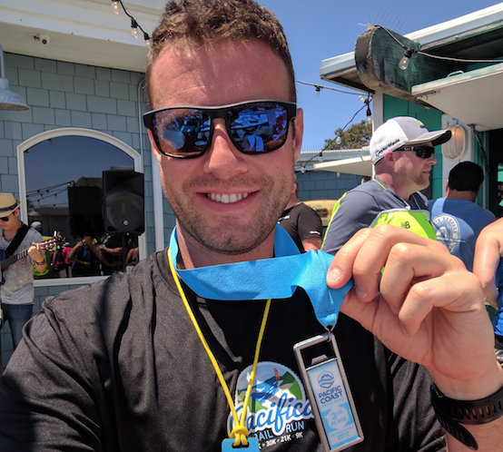
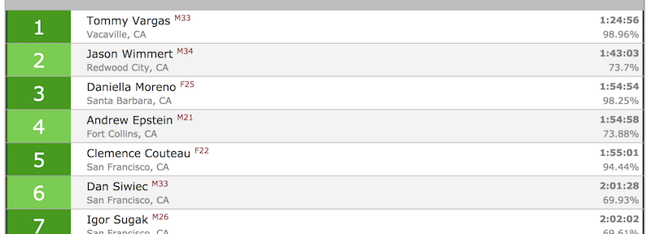

My first and certainly not last run with [Pacific Coast Trail Runs](http://www.pctrailruns.com/). Wonderful, small (56 participants in 21k distance) out-and-back trail run with a solid elevation gain of 2480 ft!

Nice beer opener medal for 3rd position in my age category. Thank you for organizing, PCTRuns!

Results:

Finished 6th out of 56 participants.

