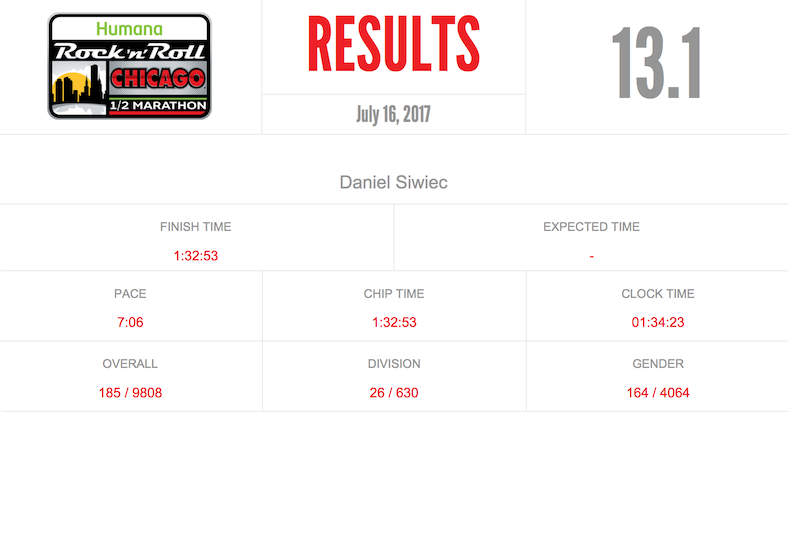

Thank you Chicago for overcast sky on the race day and saving your sunny weather for another summer day. Apologies for a watermarked photo, but I couldn't justify shelling out $45 for a 5 rather poor photos.

Results:

