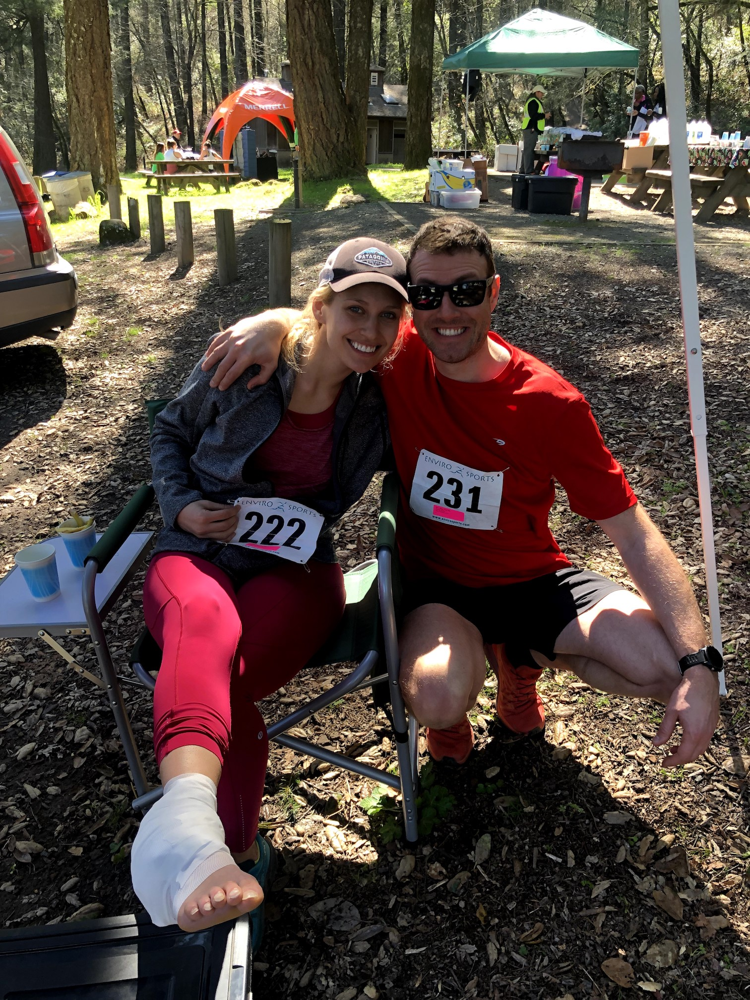
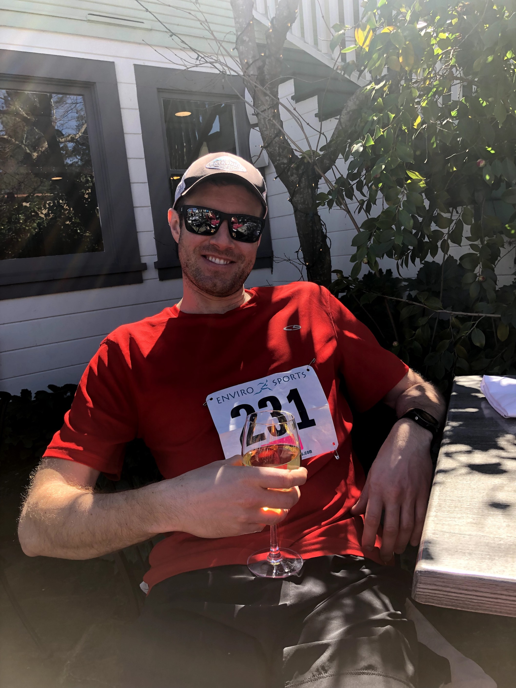

Starting the 2019 season off with this nice, steep trail run in the Calistoga area and finishing second out of ~80 participants. The front of the pack got spread within the first 1.5 mile and I didn't get to see the first nor the third runner till I got to the finish line.

Unfortunately, my partner sprained her ankle during the run after landing a leap on an uneven spot. Despite this, the smiles didn't wash off our faces that day.

The run took place in Calistoga in the Napa County. Yes, this means wine after the run.

