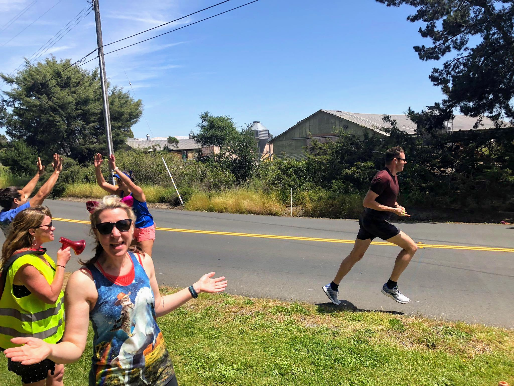
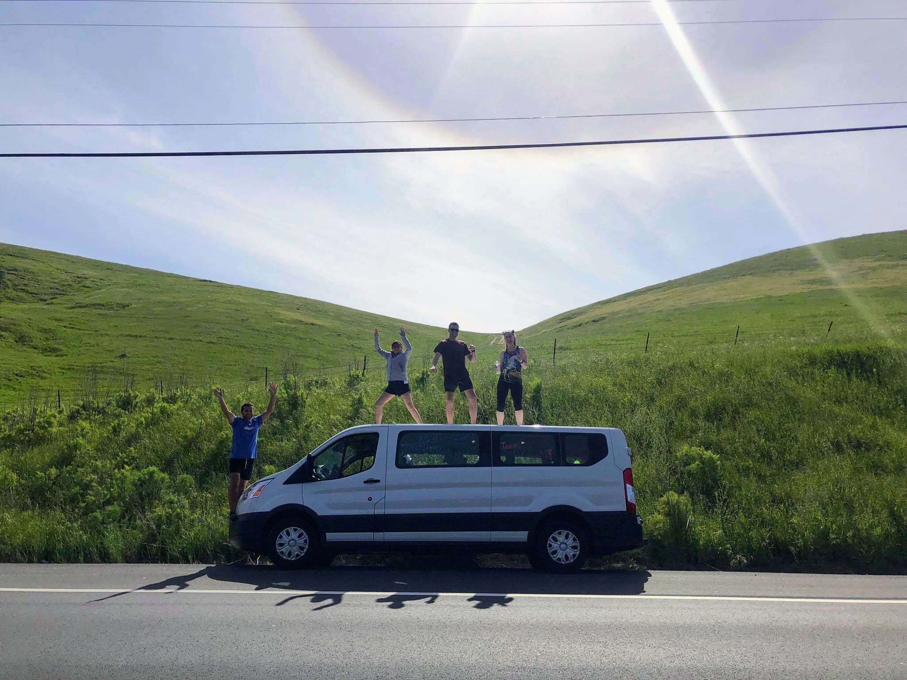
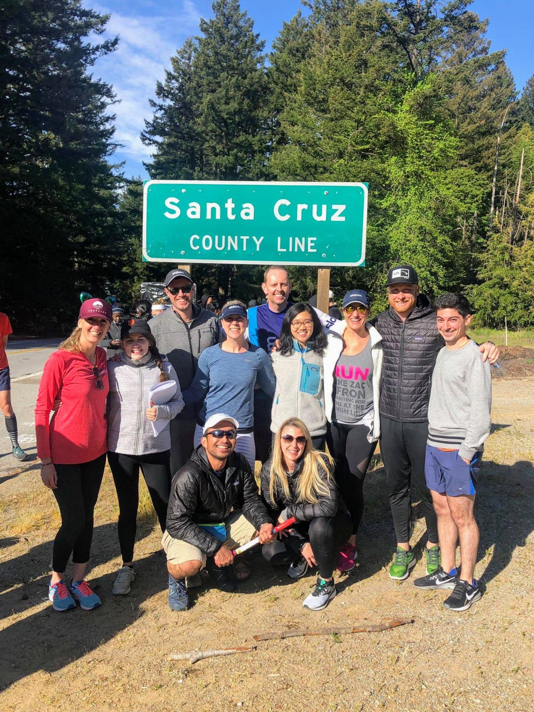

This was something else! A 12 person relay from Napa to Santa Cruz - 160 miles over roughly 36 hours, each runner completing 3 legs. Mine are [leg 10](https://connect.garmin.com/modern/activity/3618443978), [leg 19](https://connect.garmin.com/modern/activity/3619064989) and [leg 34/35](https://connect.garmin.com/modern/activity/3622446054).

