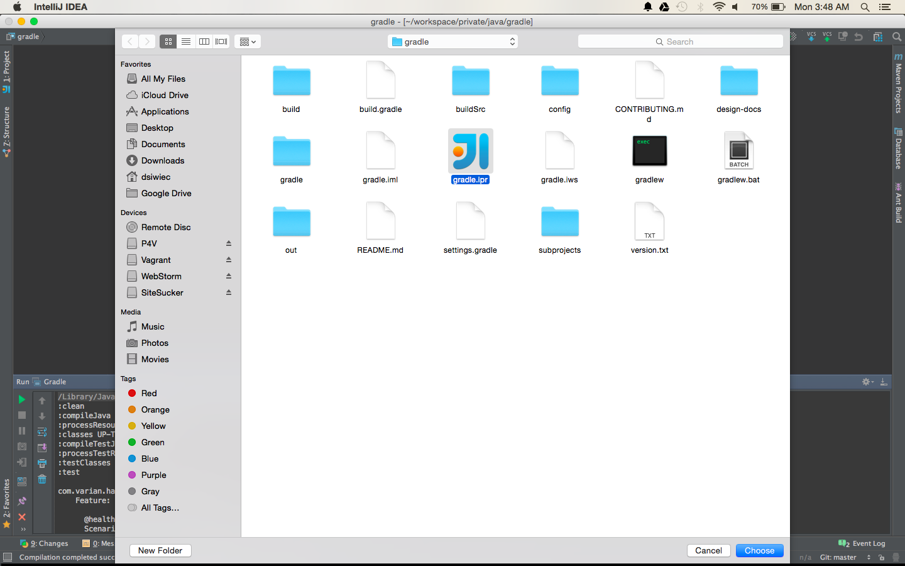
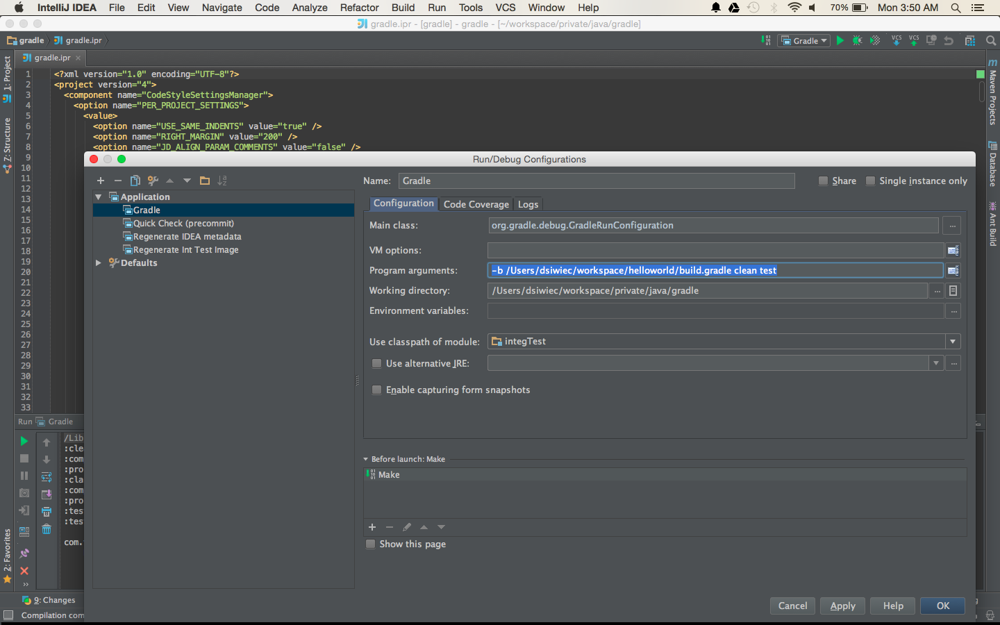
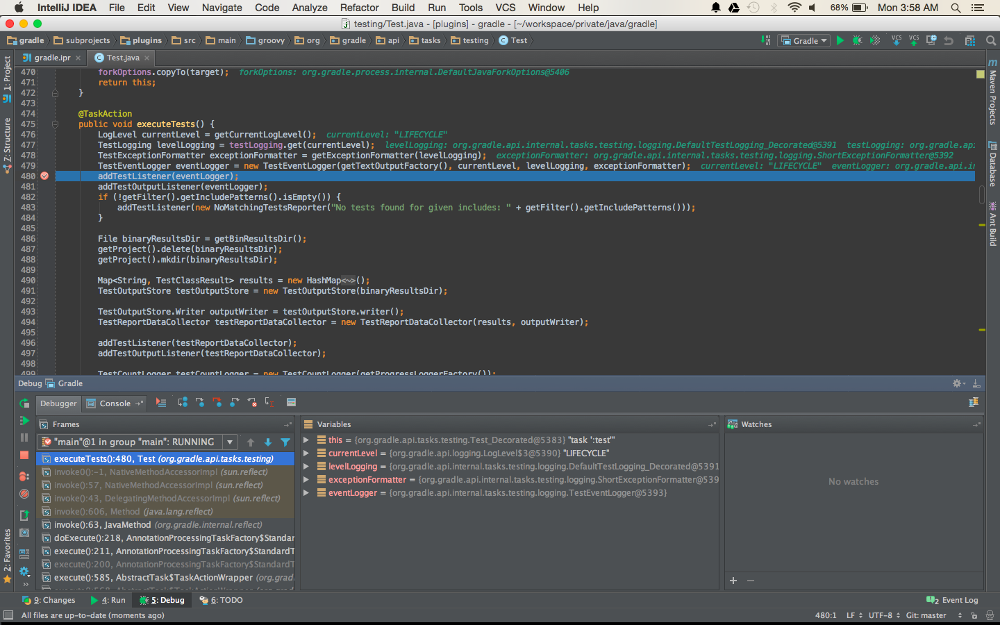

If you find yourself needing to debug Gradle source code, here's a few simple steps you need to follow. There are some great posts online that explain how to attach a remote debugger, like [this one](http://blog.gaku.net/gradle-debugging/).

In this post I show an alternative solution which runs Gradle inside the IDE.

* Clone Gradle repository:
```bash
git clone git@github.com:gradle/gradle.git
```

* Checkout a specific release:
```bash
git tag -l
git checkout tags/REL_2.2.1
```

* Generate IntelliJ files:
```bash
cd gradle
./gradlew idea
```

* Import Gradle project into IntelliJ:



* Edit **Gradle** Run Configuration to point to the project you want to run gradle on:



The **-b** option allows you to pass a path to the build.gradle

* Set your breakpoints

* Hit Debug and wait for your breakpoint:

