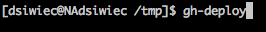
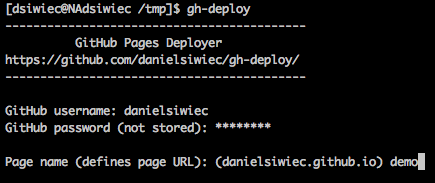
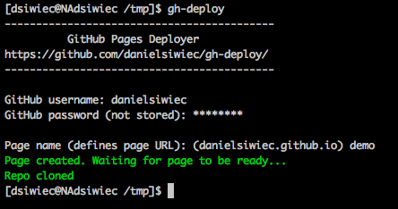
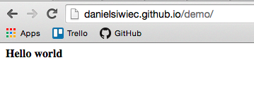
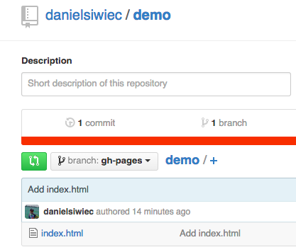

Sometimes, you just need to host a simple, static HTML page on the web. GitHub makes
it much easier, with the introduction of the [GitHub Pages](https://pages.github.com/) service. There's still a couple steps required to get started with GitHub pages.
Introducing **gh-deploy**. This module leverages this service and automates the whole setup.

# Prerequisites

* github account
* npm

# Steps

* Install the gh-deploy module

npm install -g gh-deploy

* Run it

* Follow the wizard steps

* Wait for the page to be created

# Results

* The page deployed and accessible

* GitHub repo created with a stub index file:

# Demos

Checkout the demos on YouTube:

Part I - Hello World (19 seconds)</a> (a little outdated - there are no input arguments anymore - the wizard asks about them)

<iframe width="420" height="315" src="https://www.youtube.com/embed/vJlg-0y2fTY" frameborder="0" allowfullscreen></iframe>

Part II - Deploy Todo MVC (36 seconds)

<iframe width="420" height="315" src="https://www.youtube.com/embed/5stwAqtgWTg" frameborder="0" allowfullscreen></iframe>
