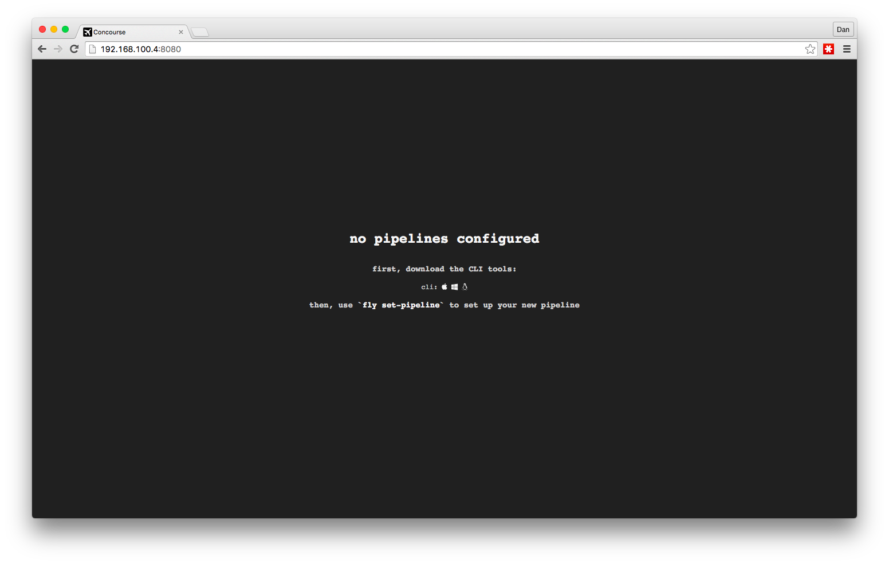
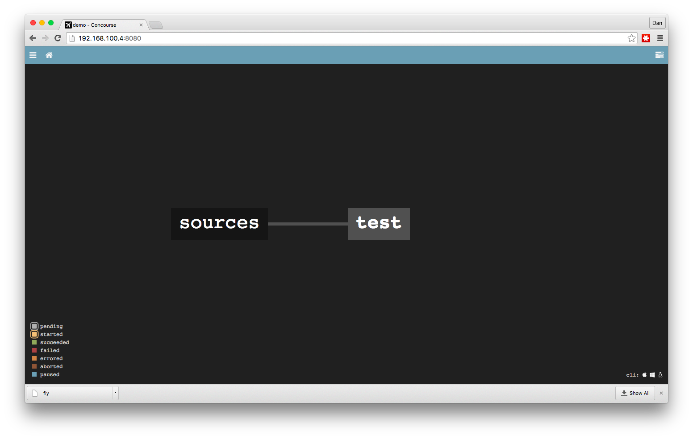
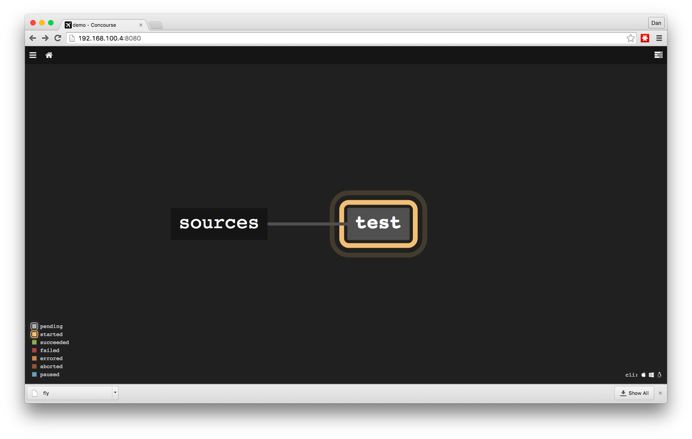

*For a refreshed version of this post, go [here](/2016/05/05/setting-up-a-simple-pipeline-with-concourse-ci-redux/)*

# Intro
In this post I'll introduce you to Concourse CI and walk you through a configuration of a simple pipeline. We'll setup concourse from scratch and create a basic pipeline for running unit tests.

# What is it?
[Concourse CI](http://concourse.ci) is a relatively new CI offering. The product's homepage does a good job of [explaining](http://concourse.ci/concourse-vs.html) the key features differentiating it from a plethora of other CI solutions, but here's my short list, which attracted my attention:

### Pipeline as Code™
No more pointy-clicky setups anymore. No more issues with versioning the CI configurations. Instead of developing tools to extract the CI configuration into a file that can later be imported or versioned, Concourse takes a completely opposite approach - it generates the pipeline from the configuration files in the first place. I call this approach Pipeline As Code™ and I've always been its avid supporter. It's great to see it being enforced by the platform. One great benefit that stems from it is a stateless nature of the CI server.
This item has also been [recently listed](https://www.thoughtworks.com/radar/techniques/programming-in-your-ci-cd-tool) on the ThoughtWorks technology radar.

### Phoenix build agents
No more snowflake build agents. No more debugging issues caused by dependencies cached by previous builds. More on phoenix servers [here](http://martinfowler.com/bliki/PhoenixServer.html)


### CLI and API first, UI later
We, developers, love APIs. They allow for task automation and controlling things directly from the terminal, without touching the mouse :)
The north star guiding the Concourse development team is to provide complete functionality via the CLI. Big shout out for this approach!

### Personal builds made easy
A relatively new concept, personal builds, allow you to run an instance of the pipeline without committing the code to the central repository. This avoids classic push-fail-push-fail-push-pass scenarios caused by discrepancies between dev's local environment and the CI. I'll show how Concourse supports this method later on.

# Getting started

## Prerequisites

- git
- vagrant & virtualbox
- 4GB of RAM to spend

## Let's go

First, clone my demo repo [here](https://github.com/danielsiwiec/concourse-demo) and do
```bash
  vagrant up
```
You know you're on the right path, when you see this at [http://192.168.100.4:8080/](http://192.168.100.4:8080/)




Second, download the CLI tool, **fly** via the link on the screen above, make it executable (```chmod +x fly```) and put it in a place that's on the PATH (e.g. ```/usr/bin/```)

Now, let's configure the pipeline. Yes, over the CLI - no pointy-clicky operations!
```bash
  fly set-pipeline -c pipeline/pipeline.yml -p demo
```

If everything goes right, you'll see this on the main page:

The UI is very basic, but it's all a man could ever wish for. It does what it should - shows your pipeline's status.

Let's switch over to the terminal and see what else **fly** can do for us:

```bash
fly pipelines

  name  paused
  demo  yes
```

That's pretty self explanatory. What else?

```bash
fly get-pipeline --pipeline demo

  groups: []
  resources:
  - name: sources
  type: git
  source:
    branch: master
    uri: https://github.com/danielsiwiec/concourse-demo.git
  jobs:
  - name: test
  plan:
  - get: sources
    trigger: true
  - task: install
    file: sources/pipeline/install.yml
  - task: test
    file: sources/pipeline/test.yml
```

The pipeline starts in a paused state, so let's turn it on:

```bash
fly unpause-pipeline -p demo

  unpaused 'demo'
```

In a few seconds your screen should change to this, which indicates the pipeline is running:


Additionally, there are two **fly** commands that allow us to peak into task's execution:

**watch** displays a log stream for the selected, currently running build:

```bash
fly watch -j demo/test
  Cloning into '/tmp/build/get'...
  7341378 fix install input
  initializing with docker:///node#4.2.3
  running ./pipeline/install.sh
  npm info it worked if it ends with ok
  npm info using npm@2.14.7
  npm info using node@v4.2.3
  ...
  ...
```

**intercept** allows to ssh into a container of a recently finished task and inspect its contents:

```bash
fly intercept -j demo/test -s test
  root@8439shbpuqe:~# cd /tmp/build/0dfa9ec2-3566-4a35-6491-e6517a888e7b/
  root@8439shbpuqe:/tmp/build/0dfa9ec2-3566-4a35-6491-e6517a888e7b# ls -l
  total 8
  -rw-r--r-- 1 root root 188 Dec 17 09:30 Vagrantfile
  drwxr-xr-x 1 root root  32 Dec 17 09:30 lib
  drwxr-xr-x 1 root root  22 Dec 17 11:09 node_modules
  -rw-r--r-- 1 root root 364 Dec 17 09:30 package.json
  drwxr-xr-x 1 root root  96 Dec 17 09:30 pipeline
  drwxr-xr-x 1 root root  60 Dec 17 09:30 spec
```

# Notes

## Passing artifacts

As usually with build pipelines, you'll want to pass some artifacts around. Either between resources, jobs or tasks. In this example, the result of the first task, install, is passed to the test task. The documentation isn't very specific about it, but each task has got an **implicit** output, named after the task name, so in order to for those two tasks to share the output we specify it in the install task definition like this:

```yaml
inputs:
  - name: install
    path: .
```

This instructs concourse to take the root folder of the install task and use it as a root folder of the test task.

## Personal builds

As I mentioned before, this is a very handy utility, that concourse, thanks to it's architecture based on inputs and outputs supports really well. To picture it, let's assume that we want to execute the test task, without committing the code to the central repository. It might be helpful especially in debugging scenarios, when our local environment is in some way different from the CI one and yields different results. This is how it's done:

```bash
fly execute -c pipeline/test.yml -i install=.
  executing build 22
  initializing with docker:///node#4.2.3
  running ./pipeline/test.sh

  Started
  .....


  5 specs, 0 failures
  Finished in 0.021 seconds
  succeeded
```
The **-i** flag specifies the inputs for the task, as defined in the task yaml (**test.yml** in this case).

Side note: Currently, only running individual tasks is supported. To run a part of the pipeline, you'll have to manually combine the output of one task (using **-o** flag) with the input of the next one.
