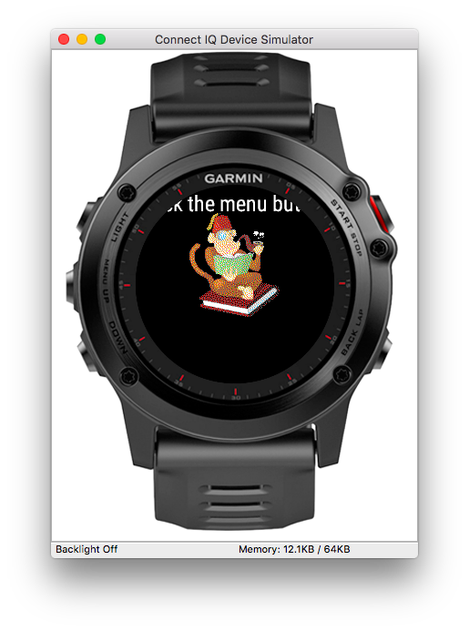

# Intro
In this series of posts I will walk you through the development process of a [Garmin Connect IQ](http://developer.garmin.com/connect-iq/) application. The application that we will develop is a [Tabata](https://www.verywell.com/tabata-training-definition-1230982) timer, that has been published on Garmin's IQ [store](https://apps.garmin.com/en-US/apps/62708c6e-b063-4cb1-994f-283b32d5ddf8) with over 35000 downloads.

In Part 1 we will set up the development environment and say Hello to Monkey C - the language you will use to write Connect IQ applications.

# Get the SDK
First things first! Get the SDK [here](https://developer.garmin.com/connect-iq/overview/). This post has been written with version *2.4.4*, so any *2.x.x* version will do. You will also need Java Runtime Environment in version 8 or higher.

## Overview of the SDK
If this is your first contact with Monkey C, I recommend skimming through the official [introduction](https://developer.garmin.com/connect-iq/programmers-guide/monkey-c/). Monkey C, despite being tiny in its API, provides direct access to all the device's major features like Activity Tracking, sensors (location, heart rate sensor, compass), buttons, etc.

# Project seed
Garmin suggests using an Eclipse plugin for your development, but in my experience it's not a good option for a couple reasons. The Monkey C language is weakly typed, so the IDE doesn't provide much support like code completion, as it does with Java for instance. Secondly, development life cycle operations like compilation, running, packaging are not natively supported by Eclipse. Lastly, neither the plugin, nor Eclipse itself are good quality products, with many bugs, low responsiveness and poor developer experience. I also believe, that developers should be free to pick their own IDE.

What I found much more preferable is using my favorite text editor - [Visual Studio Code](https://code.visualstudio.com/) with *make* scripts to compile/run/package the application. For this purpose, I created a seed project, that can be used to kick start a Connect IQ application. You can find it [here](https://github.com/danielsiwiec/garmin-connect-seed). Once you clone this repository, follow the instructions in *README.md*.

# Hello... Monkey C
Finally, confirm your setup is working by typing ```make run``` in the project's root folder. You should see this output:


Congratulations, that's all for Part 1!
