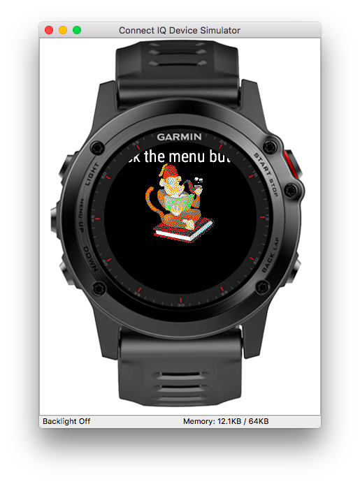

# Intro
This post walks you through the development process of a [Garmin Connect IQ](http://developer.garmin.com/connect-iq/) application. The application that we will develop is a [Tabata](https://www.verywell.com/tabata-training-definition-1230982) timer and it a real app, that has been published on Garmin's IQ [store](https://apps.garmin.com/en-US/apps/62708c6e-b063-4cb1-994f-283b32d5ddf8) with over 2000 downloads so far.

# Prerequisites

## Get the SDK
Go [here](https://developer.garmin.com/connect-iq/overview/) and get the SDK. This post has been written with the *1.2.9* version.

## Project seed
Garmin suggests using an Eclipse plugin for your development, but in my experience it's not a good option for a couple reasons. The Monkey C language is weakly typed, so the IDE doesn't provide any support like code completion, as it does with Java for instance. Secondly, development lifecycle operations like compilation, running, packaging are not natively supported be Eclipse. Lastly, neither the plugin, nor Eclipse itself are good quality products (many bugs, low responsiveness, etc)

Instead, what I found much more productive is using my favorite text editor ([atom](https://atom.io/)) with **make** scripts to compile/run/package the application.
Clone [this](https://github.com/danielsiwiec/garmin-connect-seed) repository to get started and fill out the properties file.

## Hello... Monkey C
Confirm your setup is working by typing ```make run``` in the project's root folder. You should see this:


# Overview of the SDK
If this is your first contact with Monkey C, I recommend skimming through the official [introduction](https://developer.garmin.com/connect-iq/programmers-guide/monkey-c/), as I will not be covering the language basics.

Monkey C, despite being tiny in its API, provides direct access to all the device's major features like Activity Tracking, sensors, buttons, etc.
## High level language (easy access to device features - pro)

## Varying support for different watches (con)

# Coding patterns

# Code walk through

# Make file instead of

# Submission process

# New SDK version (2.0)

# Useful links
Forum
Garmin SDK docs
Garmin seed project
