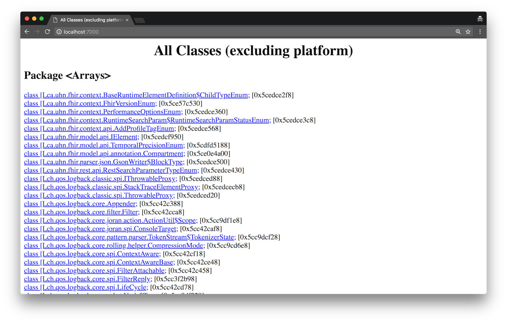
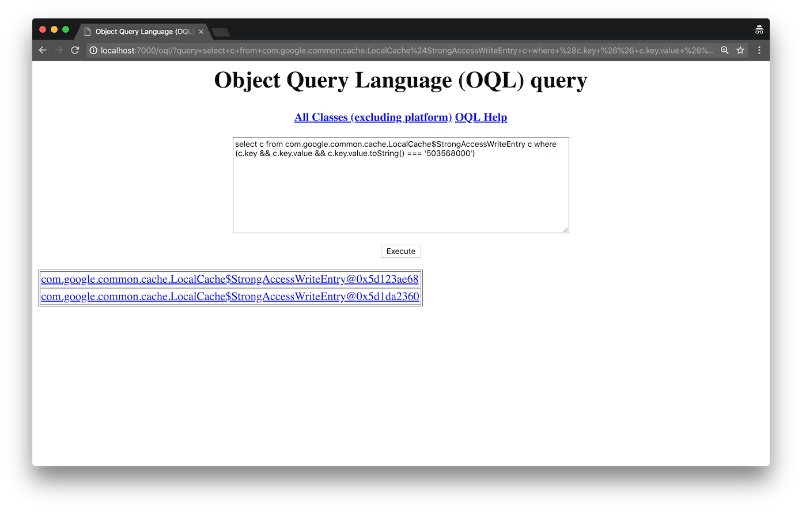
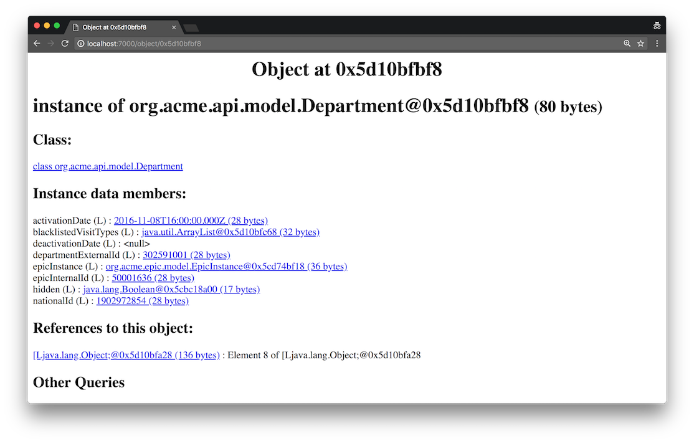

# So, what's going on?

Recently, I was working with a Spring Boot application, written in Java 8, which makes use of the `@Cacheable` annotation to cache responses of some expensive calls to back-end services.

There was a production incident reported, which suggested that one of the cached responses did not expire and became stale. To confirm this, one of the instances of the application was restarted, to flush out any state in it, after which it started behaving properly again. Specifically, the problematic interface is the following:

```java
@Cacheable("findDepartmentById")
public Department findDepartmentById(String departmentId);
```

This stores each return value inside a cache map, with the key being the `departmentId`. After a pre-configured time, the cache entry is evicted and the next call, will send an actual request to the back-end service, which will be cached again.

The objective was to take a heap dump of a *broken* instance and look inside, in hope of find a smoking gun around the cached responses stored in the cache map.

# What is a Heap Dump?

Per the Java [documentation](https://docs.oracle.com/javase/8/docs/technotes/guides/visualvm/heapdump.html):

> A heap dump is a snapshot of all the objects in the Java Virtual Machine (JVM) heap at a certain point in time. The JVM software allocates memory for objects from the heap for all class instances and arrays. The garbage collector reclaims the heap memory when an object is no longer needed and there are no references to the object. By examining the heap you can locate where objects are created and find the references to those objects in the source.

# Obtaining the Heap dump
There are a few ways to obtain a heap dump of a Java application. We will look at two most common ones.

## From a living process
Since Java 6, a tool called **jmap** allows for capturing heap dumps from a running Java process. Here's how to use it:

```bash
jmap -dump:format=b,file=<filename> <pid>
```

Where *filename* is the output filename for the heap dump and *pid* is the process id of the Java process.

Java 8 ships with a new utility, **jcmd**, which is richer in features and has got lower performance implications. It is recommended to use it over the older one, when possible. Here's the usage:

```bash
jcmd <pid> GC.heap_dump <filename>
```

## At application crash
Optionally, the JVM can automatically generate the heap dump in the event of an OutOfMemoryError crash, if the `-XX:+HeapDumpOnOutOfMemoryError` flag is passed to the JVM at startup.

# Analyzing the heap dump
Once you have the heap dump file, you're ready to analyze it. Depending on what you're looking for, tools will differ. In our case, we want to find a particular instance of a class (cache entry) and inspect it's state. For this we will use a simple, built-in tool, called **jhat**, which we can start like this:

```bash
jhat <filename>
```

Where *filename* is the heap dump file.

The utility analyzes the heap dump file and starts a web application, which we can access through the browser, by default on port 7000. It should look like this:



The main page isn't very useful - it is a list of all loaded classes. The cache entry class is on the list as well (`com.google.common.cache.LocalCache$StrongAccessWriteEntry`), however it has got thousands of instances, which makes manual inspection of the cache contents useless. Object Query Language to the rescue!

## OQL
*Object Query Language* is a declarative query language modeled after SQL. It allows us to perform a search by given criteria - in our case, we want to find the cache entry, for a particular cache key. The `StrongAccessWriteEntry` has an instance field `key` which we can use in the query, in order to find the right entry:

```sql
select c from com.google.common.cache.LocalCache$StrongAccessWriteEntry c
where (c.key && c.key.value && c.key.value.toString() === '1184675761')
```

This gives us a list of results:



Drilling into the object hierarchy, lets us eventually see the cached value and inspect it's properties:



You can get basic help with OQL at `http://localhost:7000/oqlhelp/`.